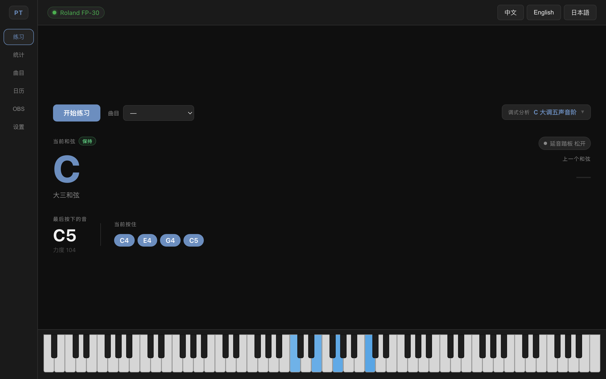
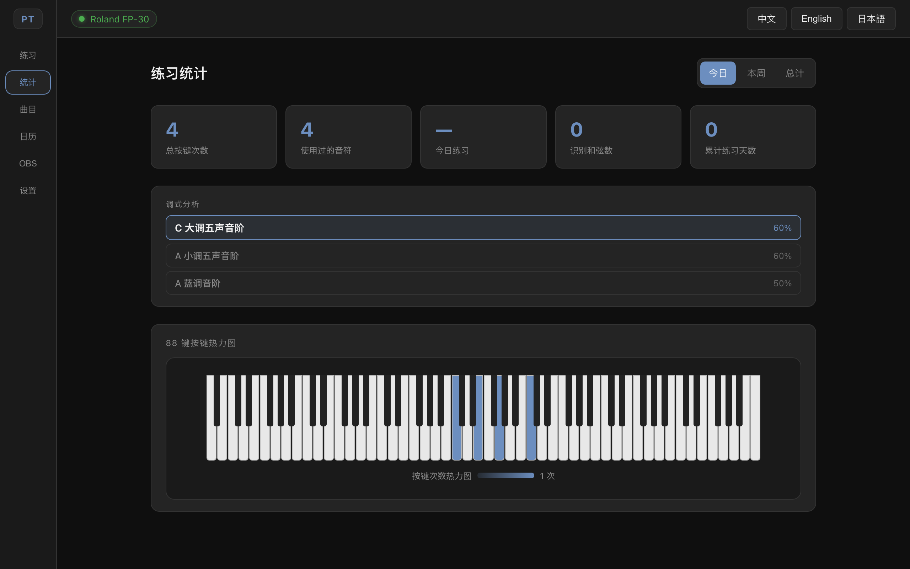
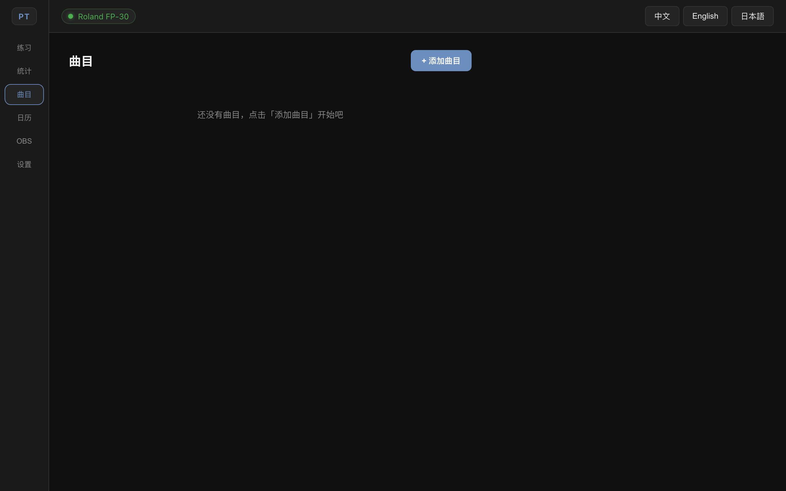
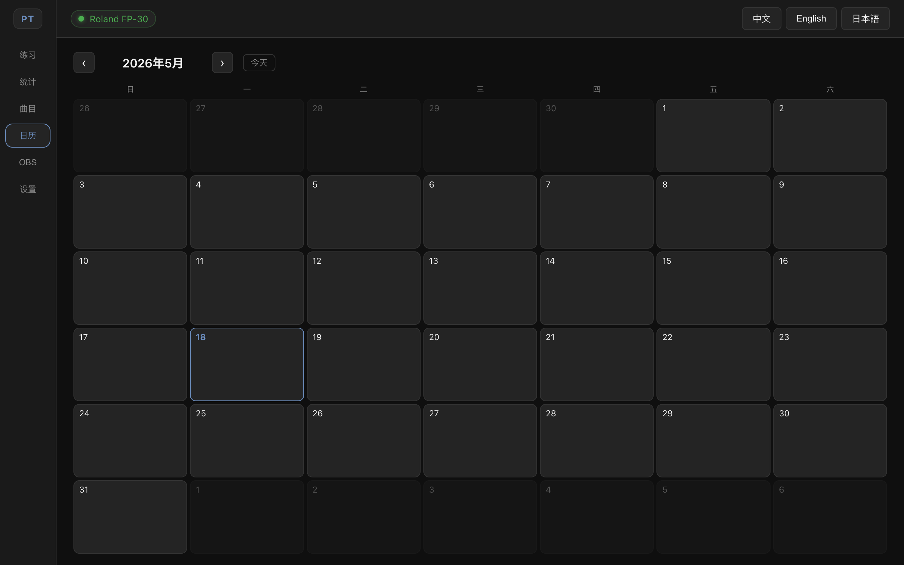
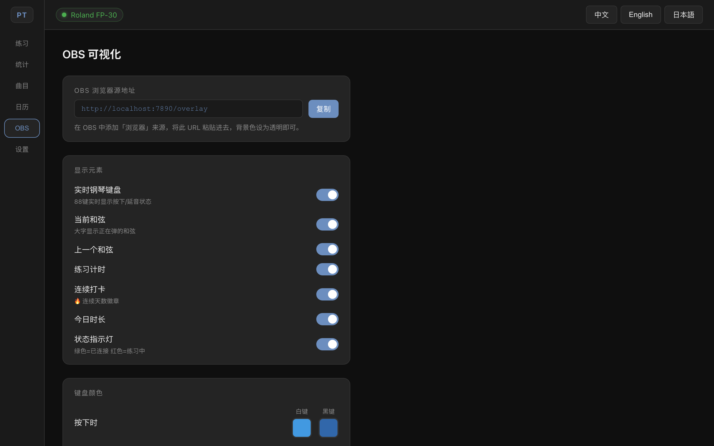

# PianoTracker

**[English](README.md) · [中文](README.zh-CN.md) · [日本語](README.ja.md)**

---

A desktop practice tracker for pianists — connects to your MIDI keyboard, records sessions, visualizes your progress, and streams a live overlay to OBS.

> Built with Electron + React + TypeScript. Offline-first with SQLite. Designed to be open-source.

---

## Screenshots

| Practice | Statistics |
|---|---|
|  |  |

| Songs | Calendar |
|---|---|
|  |  |

| OBS Overlay Settings |
|---|
|  |

---

## Current Status

PianoTracker now covers the core practice loop end to end: MIDI input, live piano visualization, chord and scale recognition, session recording, daily statistics, calendar planning, song tracking, and OBS overlay output. Recent development added richer session metrics, song-linked practice sessions, calendar practice plans, configurable OBS piano colors, and an About section in Settings.

The next major direction is deeper analysis: importing MIDI reference files, comparing timing and note accuracy, separating left/right-hand parts, and exporting practice data.

---

## Features

### 🎹 Real-time MIDI
- Auto-detects Roland FP-30 (and other USB MIDI devices) — plug in and play, no restart needed
- 88-key live keyboard visualization with velocity-based color intensity
- Sustain pedal tracking (distinguishes pressed vs. pedal-sustained notes)
- Real-time chord recognition: root note, quality (major / minor / diminished / augmented / sus / 7th / 9th), inversion

### 📊 Practice Statistics
- Per-session and daily press count, duration, unique notes, chords recognized
- 88-key heatmap showing which notes you play most
- Scale analysis: detects the scale you're playing in (major, natural minor, Dorian, Pentatonic, Blues, etc.) as you go
- Practice summaries for today, this week, and all-time history

### 📅 Calendar & Plans
- Monthly calendar grid — see every day you practiced at a glance
- Practice intensity coloring for days with recorded sessions
- Right-click any day to add a practice plan: set a goal duration and write notes
- Practice page shows today's plan as a banner when one exists

### 🎵 Song List
- Track pieces you're learning with status: Not Started / Practicing / Completed
- Add composer, notes, and update status any time
- Link a practice session to the piece you are working on

### 📡 OBS Live Overlay
- Local HTTP server at `http://localhost:7890/overlay` — add as a Browser Source in OBS
- **Live 88-key piano** rendered full-width at the bottom of the overlay (canvas, real-time via SSE — no polling delay)
- Configurable display elements: current chord, last chord, practice timer, streak badge, today's duration, status indicator
- Separate key color settings for the OBS piano (pressed / sustained, white / black keys) — or sync from practice settings in one click
- Theme options: Dark / Light / Minimal
- Adjustable position (4 corners), chord font size, background opacity

### ⚙️ Settings
- Chord hold threshold: ignore brief chord changes when lifting fingers
- Key color customization with RGBA color picker — white and black keys independently, for both pressed and sustained states
- About section with project metadata

### 🌐 Localization
- Chinese (Simplified) · English · 日本語

---

## Tech Stack

| Layer | Technology |
|-------|------------|
| Desktop | Electron 31 |
| UI | React 18 + TypeScript |
| Build | electron-vite + Vite |
| Database | better-sqlite3 (offline-first) |
| MIDI | Web MIDI API |
| OBS Server | Express 5 + SSE |
| Color Picker | react-colorful |
| i18n | i18next + react-i18next |

---

## Getting Started

### Prerequisites

- [Node.js](https://nodejs.org/) 18 or later
- A USB MIDI keyboard (developed and tested with Roland FP-30)

### Install & Run

```bash
git clone https://github.com/luoyeye001/PianoTracker.git
cd PianoTracker
npm install
npm run dev
```

The app window opens automatically. Connect your MIDI keyboard via USB — it will be detected instantly.

### Build

```bash
# Windows installer (.exe)
npm run pack:win

# macOS disk image (.dmg)
npm run pack:mac
```

Output is placed in the `dist/` folder.

---

## OBS Setup

1. Start PianoTracker
2. In OBS, add a **Browser** source
3. Set the URL to `http://localhost:7890/overlay`
4. Set width/height to match your canvas (e.g. 1920×1080)
5. Set background color to transparent (Custom color → #00000000)
6. Customize display elements from the **OBS** tab inside the app

---

## Project Structure

```
src/
├── main/               # Electron main process
│   ├── index.ts        # App entry, window creation
│   ├── db.ts           # SQLite schema & queries
│   ├── ipcHandlers.ts  # IPC channel registrations
│   └── obsServer.ts    # Express HTTP + SSE server
├── preload/
│   └── index.ts        # Secure bridge (contextBridge)
└── renderer/src/
    ├── App.tsx          # Root component, OBS state push
    ├── hooks/           # useMidi, usePracticeSession, useSettings, ...
    ├── components/      # RealtimePiano, PianoHeatmap, Sidebar, ...
    ├── pages/           # PracticePage, StatsPage, CalendarPage, ...
    ├── utils/           # chordRecognition, scaleAnalysis
    └── i18n/            # zh / en / ja translations

resources/
└── obs-overlay/
    └── index.html      # Standalone OBS overlay page
```

---

## Development Progress

### ✅ Completed
- MIDI hot-plug detection and 88-key real-time visualization
- Sustain pedal tracking, chord recognition, and scale analysis
- Practice sessions with duration, keystrokes, unique notes, recognized chords, and optional linked song
- Daily summaries, statistics cards, 88-key heatmap, monthly calendar, and practice plans
- Song list with composer, notes, and status tracking
- OBS browser-source overlay with SSE updates, piano display, chord/timer/streak widgets, themes, position, opacity, and independent key colors
- Multilingual UI: Chinese, English, and Japanese

### 🔲 Next
- MIDI file import and reference visualization
- Error and rhythm analysis against reference MIDI
- Left/right-hand separation
- Data export as CSV / JSON
- Tracker Board-style scrolling note timeline
- Optional cloud sync via Supabase or another self-hostable backend

---

## License

[MIT](LICENSE) © 桃玖
